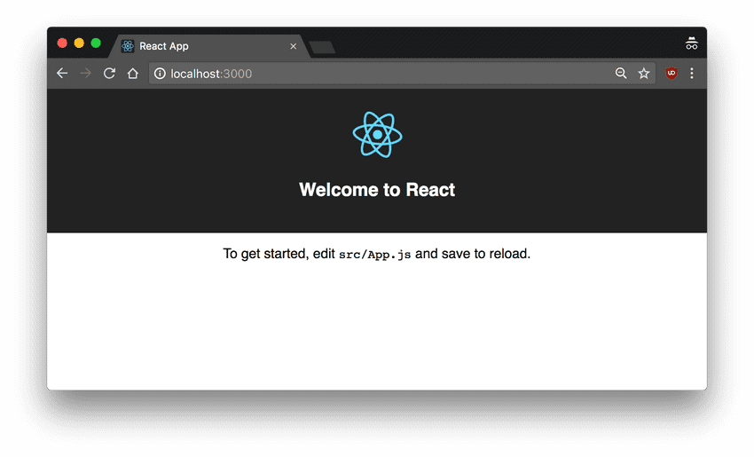

# Create React App

El método antes usado fue solo cargar librerías de JavaScript dentro de una pagina estática de HTML, ademas el renderizado del React y Babel no es muy eficiente y muy difícil de mantener. 

Afortunadamente, Facebook ha creado [`Create React App`](https://facebook.github.io/create-react-app/), un ambiente que viene pre-configurado con todo lo que necesitas para crear tu aplicación en React. Esta opción creara un servidor en vivo, usamos Webpack para compilar automáticamente 

 Ahora para configurar, ejecuta el siguiente código en tu terminal `Create-react-app` 

Revisa que tengas instalados Node.js  5.0 en esta versión o mayor

```text
npx create-react-app react-tutorial
```

Una vez hayas completado esta instalación, dirígete a la nuevo directorio creado e inicia el proyecto.

```text
cd react-tutorial
npm start
```

Luego de correr este comando, una nueva ventana aparecerá en `localhost:3000`  con tu nueva aplicación de React.



Si miramos la estructura del proyecto, podremos observar que existe varias carpetas generadas en nuestra aplicación como `/public` y `/src` acompañadas con las carpetas `node_modules`,  `.gitignore`,   el `README.md` y el  `/package.json`

