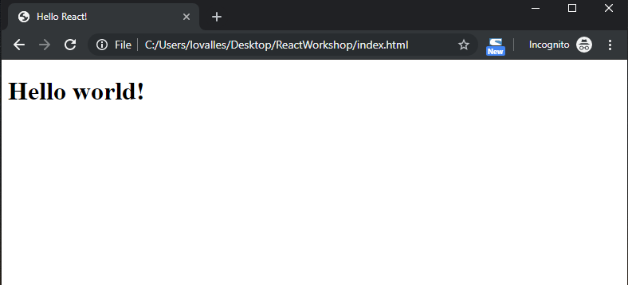

# Siguiendo nuestra configuración

El punto de entrada para nuestra aplicación sera el elemento div  con **id** `root` , el cual es llamado así por convención. También notaras que el script type `text/babel` el cual es obligatorio para el uso de Babel.

Ahora, vamos a escribir nuestro primer bloque de código en React. Es por ello que crearemos nuestra primer clase definida en el script `text/babel` 

Vamos a usar clases de ES6 para crear un en React llamado `App`  

```text
class App extends React.Component {
    //...
}
```

Ahora añadiremos el método `render`,  el cual es el único método obligatorio en un clase componente, el cual es usado para mostrar los nodos del DOM.

```text
class App extends React.Component {
  render() {
      return (
          //...
      );
  }
}
```

Vamos a colocar dentro del `return`, lo que parece como un simple bloque de HTML elemento. Note que NO vamos a retornar un string aquí, así que no usemos el símbolo `" "` alrededor del elemento. Esto es llamado `JSX`, y aprenderemos sobre ello mas adelante.

```text
class App extends React.Component {
    render() {
        return (
            <h1>Hello world!</h1>
        );
    }
}
```

Finalmente, vamos a usar el metodo  REACT DOM `render()`para renderizar la clase app que creamos dentro del div `root`en nuestro HTML.

```text
ReactDOM.render(<App />, document.getElementById('root'))
```

Aquí podemos ver como debería quedar nuestro`index.html`

```text
<!DOCTYPE html>
<html>

  <head>
    <meta charset="utf-8" />
    <title>Hello React!</title>
    <script src="https://unpkg.com/react@16/umd/react.development.js"></script>
    <script src="https://unpkg.com/react-dom@16/umd/react-dom.development.js"></script>
    <script src="https://unpkg.com/babel-standalone@6.26.0/babel.js"></script>
  </head>
  
  <body>
    <div id="root"></div>
    <script type="text/babel">
      // React code will go here
        class App extends React.Component {
            render() {
                return (
                    <h1>Hello world!</h1>
                );
            }
        }
      ReactDOM.render(<App />, document.getElementById('root'))
    </script>
  </body>
  
</html>
```

Ahora si vemos abrimos nuestro archivo `index.html`en nuestro navegador, veremos que el elemento `h1` tag que creamos sera visualizado en el DOM.


Genial!!! ahora que haz creado esta vista, te puedes dar cuenta que React no esta loco para empezar. Es solo una librería de JavaScript en donde podemos cargar dentro de nuestro HTML.

Logramos este tipo de uso de React con el documento de HTML pero recuerda que era solo con el propósito de conocer esta forma, pero de ahora en adelante solo usaremos otro método para crear nuestra aplicación en React: **Create React App metodo**

Ahora si tratamos de abrir nuestro archivo `index.html`en nuestro navegador, veremos el elemento tag `h1` que creamos, visualizado en el DOM.



Estupendo !! Ahora que haz logrado esto, tu puedes ver que React no es tan loco como parece. Solo es un framework de JavaScript donde podemos cargar dentro de nuestro HTML.

Logramos esta parte para demostraste el ejemplo pero aquí solo usaremos otro metodo: Create React App.

